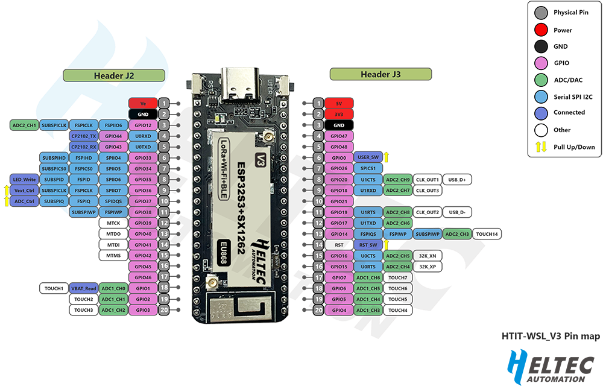

# Wireless Stick Lite (V3) Project
This project involves development using the Wireless Stick Lite (V3) SoC, utilizing the Arduino IDE. Below you will find instructions for setting up the project, hardware information, and how to edit the configuration files.

## Hardware Overview
Below is the pinout diagram for the device:

### Sensors and Pin Configurations
- **GPIO3** is used to measure the battery level.
- **GPIO48**: Connected to the **DHT22 sensor** for measuring **temperature** and **humidity**.

## TTN (The Things Network) Setup
The backend for this project communicates with **The Things Network (TTN)**. Follow the steps below to set up TTN and register your device.

### 1. Create an Account on TTN
1. Go to the [TTN website](https://eu1.cloud.thethings.network) and create an account.
2. Verify your email and log in.

### 2. Create an Application on TTN
1. Once logged in, navigate to the **Console**.
2. In the **Applications** section, click **+ Add application**.
3. Fill in the application details:
   - **Application ID**: A unique ID for your application (e.g., `wireless-stick-lite-app`).
   - **Description**: A brief description of your application (optional).
   - **Handler**: Select the appropriate handler for your region (e.g., `ttn-handler-eu` for Europe).
4. Click **Create application**.

### 3. Register Your Device
1. Go to the **Devices** tab within your application.
2. Click **Register device**.
3. Enter the following details:
   - **Device ID**: A unique identifier for your device (e.g., `wireless-stick-lite-device`).
   - **Device EUI (DevEUI)**: You can generate or retrieve the device's EUI.
   - **Application EUI (AppEUI)**: This is the EUI of your application.
   - **AppKey**: The application key that secures the communication.
4. After registering the device, you will receive the **AppEUI**, **DevEUI**, and **AppKey**. Copy these values, as they are required for the next step.

## Software Setup

### Arduino IDE Configuration
1. Download and install the Arduino IDE from the official [Arduino website](https://www.arduino.cc/en/software).
2. Configure your Arduino IDE for the Wireless Stick Lite (V3) board.
   - Add the necessary board package through the **Boards Manager**.
   - Select the correct board and port.

### Setting Up Credentials
In order to connect to wireless networks or other external systems, you need to provide credentials. These credentials are stored in a separate file called `credentials.h`.

To set this up:

1. Create a copy of the `credentials_sample.h` file.
2. Rename the new file to `credentials.h`.
3. Edit the file and replace the `0xXX` placeholders with the correct values for your system.
